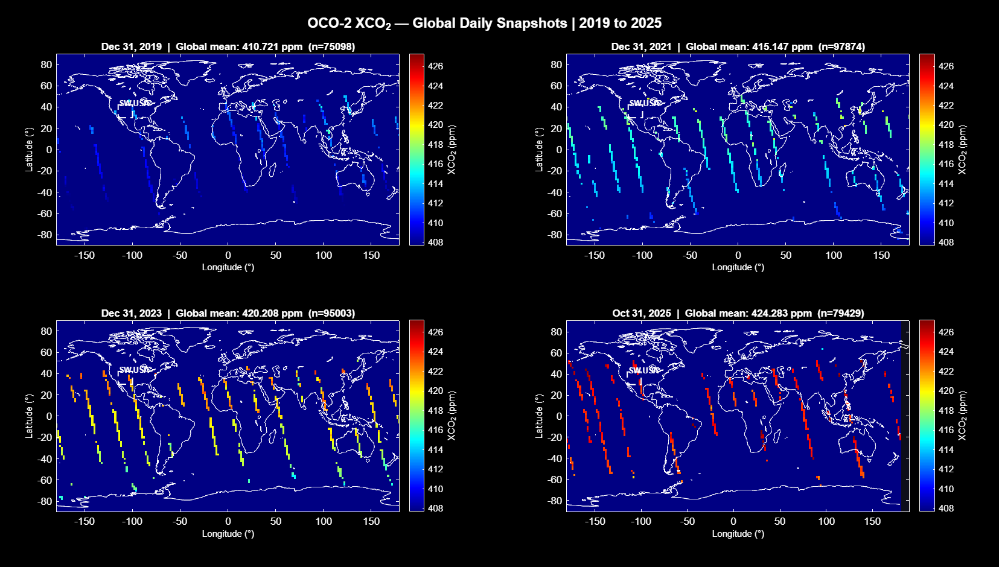
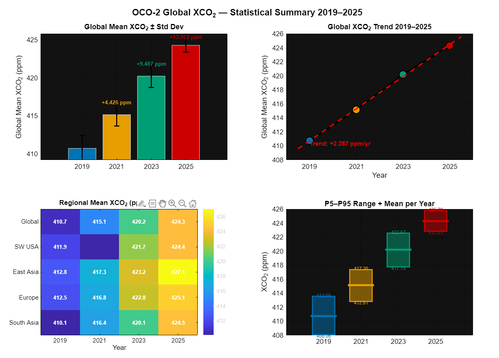
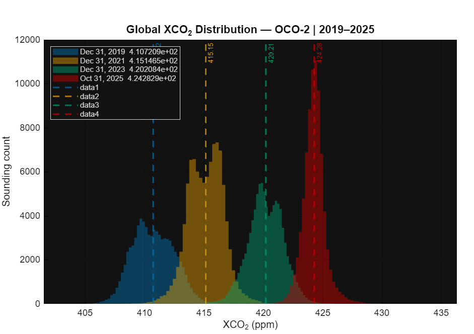
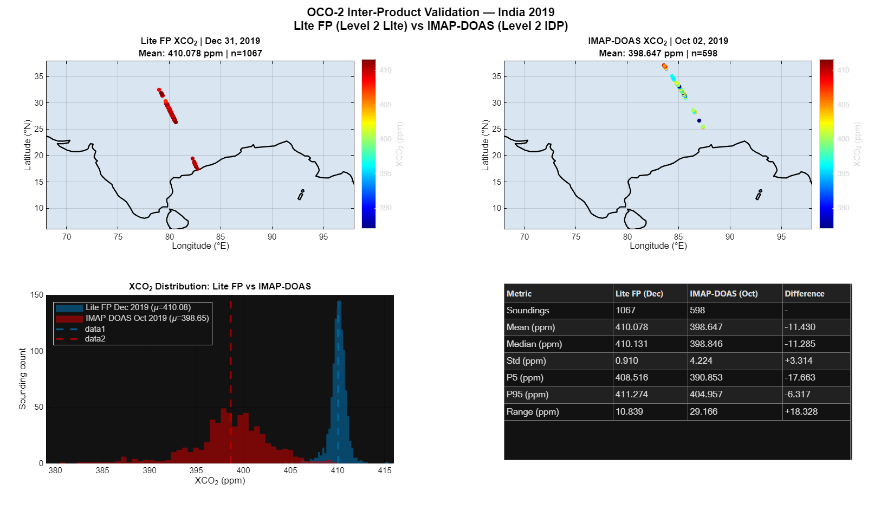

# 🛰️ NASA-OCO2-Satellite-Carbon-Analysis

### Global CO₂ Trend Analysis and Inter-Product Validation using NASA OCO-2 Satellite Data

##  Overview

Satellite-based atmospheric CO₂ analysis using NASA OCO-2 spaceborne data. Processed HDF5/NetCDF4 granules to quantify a global +13.6 ppm CO₂ rise (2019–2025) and performed inter-product validation between two NASA retrieval algorithms over India. Built in MATLAB with geospatial filtering and multi-temporal visualization.

##  Analysis 1 — Global XCO₂ Trend (2019–2025)

Processes four OCO-2 Level 2 Lite FP (V11.2) NetCDF4 granules spanning 2019 to 2025. Quality-filtered soundings are gridded at 2° resolution and analyzed across five global regions to quantify the rise in column-averaged CO₂ (XCO₂) over six years.

### Figure 1 — Global XCO₂ Spatial Maps

Each panel shows OCO-2 orbital track data for a single day, colored by XCO₂ concentration (blue = low, red = high). The diagonal stripe pattern is physically accurate — OCO-2's narrow 10km swath means only a thin slice of Earth is observed per orbit. The progressive warming of colors from 2019 to 2025 directly visualizes the rising CO₂ burden, with 2025 tracks appearing predominantly red/orange where 2019 tracks were blue/cyan over the same regions.

### Figure 2 — Statistical Summary

Four-panel statistical breakdown of the global XCO₂ rise. The bar chart shows annual global mean XCO₂ with standard deviation error bars and cumulative increases relative to 2019. The trend line shows a consistent rate of +2.3 ppm/year, exceeding the 1990s average of ~1.5 ppm/year. The regional heatmap shows East Asia consistently registering the highest concentrations in every year. The P5-P95 range boxes confirm the CO₂ rise is a global phenomenon rather than a localized signal.

### Figure 3 — XCO₂ Distribution

Overlapping histograms of all quality-filtered global soundings for each year. Each year's distribution is completely distinct with no overlap between 2019 and 2025, and the means shift monotonically from 410.7 ppm to 415.1 ppm to 420.2 ppm to 424.3 ppm. The sharpening of the 2025 peak reflects tighter orbital sampling geometry on that specific date.

### Key Findings

| Metric | Value |
|--------|-------|
| Global XCO₂ — Dec 2019 | 410.7 ppm |
| Global XCO₂ — Oct 2025 | 424.3 ppm |
| Total increase | +13.6 ppm |
| Linear trend | +2.3 ppm/year |
| Highest regional XCO₂ | East Asia (427.1 ppm in 2025) |

##  Analysis 2 — Inter-Product Validation over India

Compares two fundamentally different OCO-2 retrieval algorithms over the Indian subcontinent — the full-physics **Lite FP** product and the **IMAP-DOAS** (Iterative Maximum A Posteriori DOAS) Level 2 IDP product. Identifies, quantifies and explains the systematic bias between the two products.

### Figure 4 — Cross-Product Validation

The top panels show side-by-side spatial maps of both products over India. Lite FP values cluster tightly around 410 ppm with low standard deviation (0.91 ppm), reflecting its high-precision full-physics retrieval. IMAP-DOAS values cluster around 398.6 ppm with higher spread (std = 4.2 ppm), consistent with its simpler retrieval approach. The bottom-left histogram makes the bias immediately visible as two completely separated distributions. The bottom-right table quantifies all key metrics side by side.

### Key Findings

| Metric | Lite FP (Dec 2019) | IMAP-DOAS (Oct 2019) | Difference |
|--------|-------------------|----------------------|------------|
| Soundings | 1,067 | 598 | — |
| Mean XCO₂ | 410.08 ppm | 398.65 ppm | −11.43 ppm |
| Std | 0.910 ppm | 4.224 ppm | +3.314 ppm |
| P5 | 408.52 ppm | 390.85 ppm | −17.66 ppm |
| P95 | 411.27 ppm | 404.96 ppm | −6.32 ppm |

The ~11 ppm difference is attributed to seasonal CO₂ variability (~3–4 ppm), algorithmic retrieval differences between the two preprocessing approaches, and non-coincident orbital sampling (Oct 2 vs Dec 31, 2019).

##  Dataset

| File | Product | Date | Coverage |
|------|---------|------|----------|
| `oco2_LtCO2_191231_...nc4` | OCO-2 L2 Lite FP V11.2 | Dec 31, 2019 | Global |
| `oco2_LtCO2_211231_...nc4` | OCO-2 L2 Lite FP V11.2 | Dec 31, 2021 | Global |
| `oco2_LtCO2_231231_...nc4` | OCO-2 L2 Lite FP V11.2 | Dec 31, 2023 | Global |
| `oco2_LtCO2_251031_...nc4` | OCO-2 L2 Lite FP V11.2 | Oct 31, 2025 | Global |
| `oco2_L2IDPGL_191002_...h5` | OCO-2 L2 IMAP-DOAS V10r | Oct 02, 2019 | Global |

> Data files not included due to size constraints. Download from [NASA GES DISC](https://disc.gsfc.nasa.gov)

##  How to Run

1. Download data files from [NASA GES DISC](https://disc.gsfc.nasa.gov)
2. Place all `.nc4` and `.h5` files in the same folder as the scripts
3. Open MATLAB and navigate to the project folder
4. Run `analysis1_global_co2.m`
5. Run `analysis3_cross_validation.m`

**Requirements:** MATLAB R2019b or later | Mapping Toolbox

## 🛠️ Skills Demonstrated

- Satellite remote sensing data processing (HDF5, NetCDF4)
- Geospatial filtering, bounding box extraction and land/ocean masking
- Multi-temporal atmospheric CO₂ trend analysis
- Gridded spatial interpolation from sparse orbital track data
- Inter-product scientific validation methodology
- Statistical analysis and publication-quality visualization in MATLAB

## 📜 Data Citation

> Crisp, D., et al. (2020). OCO-2 Level 2 Lite FP, V11.2.
> NASA Goddard Earth Sciences Data and Information Services Center (GES DISC).
> DOI: 10.5067/H114N0ZUSPZL
